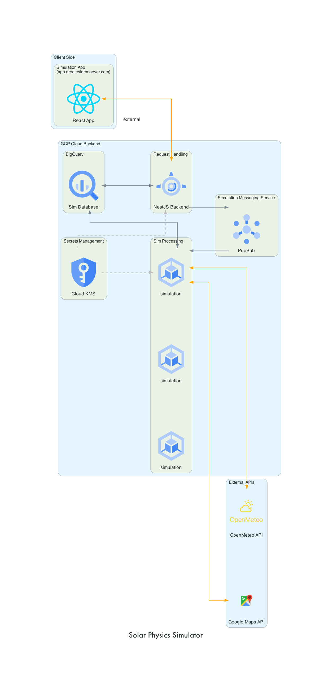

### Build Status

# How To Use:

Please use the links below to see the demo solar water heater system in action and play around! 😉🎉

- Make A Simulation - [link to simulation request maker](https://solar-simulation.greatestdemoever.com/docs#/default/create_simulation_createSimulation_post)
- Home Page - [https://solar-simulation.greatestdemoever.com/](https://solar-simulation.greatestdemoever.com/)
- Analysis & Visualization Dashboard - [Dashboard](https://lookerstudio.google.com/reporting/8fd3071e-f9d3-47ce-8211-169a2945ec67)

# The Basic Mental Model

The idea for the system is fairly straightforward. Model a system that:
1. Collects solar energy through a solar panel
2. Puts that energy into water via heat transfer into pipes that run through the solar panels
3. Pumps that newly heated water into a water tank, where it is stored
4. Consumes some of that water over time through daily activities and continues to add energy/heat to the system from solar activity
5. Logs metrics throughout the process that monitor the system to inform later decision making (analytics)
---
# Potential Use Cases

* Determining if you should get a solar panel water heater system
  * Cost/Value, Payback Time
* Optimizing Location/Positioning of large scale panel placements
  * Simple reasoning would be to pick areas with highest Direct Normal Irradiation (DNI). That is probably true or close to true, but cities may care about how consistent it is - e.g. short burts of high intensity or long periods of low intensity
  * Could model one large system versus many small ones geographically spread out a bit. Maybe diversification helps.
* Optimizing consumer behavior
  * When to shower, how much to shower, etc. to minimize energy costs and reduce need for traditional energy sources
* Optimizing hardware/system design
  * How big should solar panels be relative to water tank, how powerful should the pump be, etc.
---
# Video Walkthrough

[]

---
## Production Architecture

## Actual Implented Architecture

Time got to me LOL. Simple flask template and Google's BI tool Looker will have to do for now on the front end 

---
# A Few Key Assumptions

* Tank is always kept full on an hourly basis, water removed is filled with tap/external source

---
# Potential Improvements

* Simulation
  * Minute by minute/continuous modelling 
  * Factoring in the lengthening/shortnening of days throughout the year
  * Use Global Horizontal Irradiance (GHI)  instead of Direct Normal Irradiation (DNI)
    * Factoring in angle of sun throughout the day (lower efficiency as you get further from 90º normal to the sun)
  * Making flow rate continous instead of fixed over a period
  * Stricter/better use of boiler, right now only kicks in after water usage but could temperature could decline overnight as well
* Metrics
  * More detailed tracking of loss/inefficiency in the system
  * Converting to most relevant units (e.g. kWh instead of J)

---

# High Level Code Walkthrough

1. Running FastAPI Python app in a container (deployed on cloud run)
2. Request comes in from client, parse that to get parameters for a solar water heater system. The objects that represent the system are built and various logging/admin functions are performed. This happens in the [Simulated World object](/backend/simulations/simulationObjects/SimulatedWorld.py) 
3. That triggers [Simulated World -> run_entire_simulation()](/backend/simulations/simulationObjects/SimulatedWorld.py) , which kicks off the next few steps.
4. Address of solar panel system is converted to lat_lon, then geographical data on DNI values is collected (external API calls)
5. Historical average of past 20 years of DNI data is used as expected DNI value on go forward basis
6. System adds 1 hour of DNI Energy into [Solar Collector object](/backend/simulations/simulationObjects/SolarCollector.py) (factors in efficiency) and then gets heat energy exchanged into water flowing through panel (factors in flow rate of water and energy collected) -> raises water temp in pipes
7. Difference in energy between pipes and water tank gets absorbed into [Water Container object](/backend/simulations/simulationObjects/WaterContainer.py)
8. Water demands are also applied -> e.g. taking a shower. This factors in temp and volume to get energy lost from water heater
9. If after summing up all energy in/out, the tank is below the safe operating temp of 50ºc, then heater kicks in
10. [Water Pump object](/backend/simulations/simulationObjects/WaterPump.py) speed is increase or decreased to try to avoid making the temp difference between solar water in and solar water out too large
